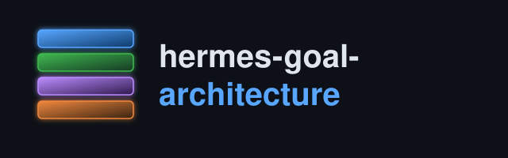

<p align="center">
  
</p>

<p align="center">
  
  
  
  
  
  
  <a href="https://github.com/danindiana/hermes-goal-architecture/actions/workflows/verify-diagrams.yml"></a>
  
  
</p>

# hermes-goal-architecture

A layered explanation of how [Hermes Agent](https://hermes-agent.nousresearch.com/)'s `/goal`
feature actually works against a local [Ollama](https://ollama.com/) model — from the system-level
"what talks to what" down to the literal bytes on the wire for a single request, plus a
plain-language version for readers who don't want the technical depth. Four technical levels, nine
diagrams total, each grounded in real source (file:line citations throughout) and, where
applicable, real `agent.log` evidence from a running system — not a from-memory sketch of how it's
supposed to work.

This repo is a companion to [`hermes-goal-loop-deferral`](https://github.com/danindiana/hermes-goal-loop-deferral),
which diagnoses and fixes two specific `/goal` bugs in depth. That repo is a case study; this one
is the reference architecture the case study sits inside of.

**New to this and don't want the technical version yet?** Start with
[`docs/lay_explain.md`](docs/lay_explain.md) — no code, no jargon, just what the system does and
why it sometimes seemed to get stuck, in plain language.

## Contents

- [Plain-language explainer](#plain-language-explainer)
- [The four technical levels](#the-four-technical-levels)
- [Diagrams](#diagrams)
- [Documentation](#documentation)
- [Repo structure](#repo-structure)
- [License](#license)

## Plain-language explainer

[`docs/lay_explain.md`](docs/lay_explain.md) covers the same ground as the four levels below —
what Hermes and Ollama are, what a standing goal actually does, why the loop sometimes looked
stuck, and what fixed it — without any code, file paths, or technical vocabulary. Three diagrams
(07-09) go with it, using plain-English labels instead of function/class names.

## The four technical levels

**Level 1 — System context.** Zoom all the way out: Hermes Agent isn't one model, it's three
separate inference/execution surfaces (a local Ollama chat model, a cloud-hosted Anthropic judge,
and a sandboxed Docker tool-execution environment) coordinated by one orchestrating process. Most
"the agent is being unreliable" reports actually originate in one specific surface, not "the model"
generically.

**Level 2 — Component architecture and turn lifecycle.** Inside the Hermes process, a small,
specific set of modules handle one turn: `cli.py` (dispatch), `agent/turn_facade.py` (the shared
entry point), `agent/conversation_loop.py` (the API-call loop), the Ollama-specific request
builder, response classification, tool execution, and the goal engine. Walked as an actual
sequence — input to continuation — in the second diagram at this level.

**Level 3 — The goal engine.** `/goal`'s own state machine (`GoalState`: active, waiting, paused,
done, cleared) and the one real decision function behind it, `GoalManager.evaluate_after_turn()`.
Four different surfaces (interactive TUI, messaging gateway, single-query automation, Kanban)
each have to solve "how do I actually run another turn" differently, but three of them drive the
*same* engine — the fourth (Kanban) is a deliberately separate, simpler mechanism.

**Level 4 — The wire.** What actually goes out over HTTP to Ollama and comes back, field by field
— including the one specific, easy-to-misunderstand behavior where `/reasoning none` (but not
`low`/`medium`/`high`) genuinely changes what gets sent to a local model, and why that one field
eliminates an entire class of stalled-loop failures by construction rather than by probability.

## Diagrams

| # | Level | Diagram | What it shows |
|---|---|---|---|
| 01 | 1 | [`system_context`](diagrams/01_system_context.svg) | Three separate surfaces, one orchestrating process |
| 02 | 2a | [`component_architecture`](diagrams/02_component_architecture.svg) | Major modules inside the Hermes process, for one turn |
| 03 | 2b | [`turn_lifecycle_sequence`](diagrams/03_turn_lifecycle_sequence.svg) | The same modules, walked as a real sequence start to finish |
| 04 | 3a | [`goal_state_machine`](diagrams/04_goal_state_machine.svg) | `GoalState`'s lifecycle and `evaluate_after_turn()`'s decision |
| 05 | 3b | [`goal_loop_driver_shapes`](diagrams/05_goal_loop_driver_shapes.svg) | Four surfaces, one shared engine (plus Kanban's deliberate exception) |
| 06 | 4 | [`ollama_request_response_anatomy`](diagrams/06_ollama_request_response_anatomy.svg) | The literal request/response fields, and where a reasoning-only stall comes from |
| 07 | lay | [`lay_big_picture`](diagrams/07_lay_big_picture.svg) | The four helpers, in plain terms — no jargon |
| 08 | lay | [`lay_how_a_turn_works`](diagrams/08_lay_how_a_turn_works.svg) | One round of work, in plain terms |
| 09 | lay | [`lay_reasoning_off_fix`](diagrams/09_lay_reasoning_off_fix.svg) | Why it looked stuck and what fixed it, in plain terms |

Each diagram ships as `.dot` (source), `.png`, and `.svg`. Re-render any of them with:

```bash
dot -Tpng -Gdpi=160 diagrams/01_system_context.dot -o diagrams/01_system_context.png
dot -Tsvg diagrams/01_system_context.dot -o diagrams/01_system_context.svg
```

CI (`.github/workflows/verify-diagrams.yml`) re-renders every `.dot` on push/PR and fails if the
committed SVG has drifted from its source.

## Documentation

One doc per diagram, each going deeper than the README summary above:

| Doc | Level | What it covers |
|---|---|---|
| [`docs/system_context.md`](docs/system_context.md) | 1 | Why treating "the agent" as one black box hides where problems actually originate |
| [`docs/component_architecture.md`](docs/component_architecture.md) | 2a | The specific modules and what each owns |
| [`docs/turn_lifecycle_sequence.md`](docs/turn_lifecycle_sequence.md) | 2b | Step-by-step walkthrough of one turn |
| [`docs/goal_state_machine.md`](docs/goal_state_machine.md) | 3a | Every state transition and what triggers it |
| [`docs/goal_loop_driver_shapes.md`](docs/goal_loop_driver_shapes.md) | 3b | Why four surfaces need different drivers for the same engine |
| [`docs/ollama_request_response_anatomy.md`](docs/ollama_request_response_anatomy.md) | 4 | Every request/response field, and the `think` gotcha |
| [`docs/lay_explain.md`](docs/lay_explain.md) | lay | The whole story, no code or jargon |

## Repo structure

```
.
├── assets/
│   └── logo.svg
├── diagrams/
│   ├── 01_system_context.{dot,png,svg}
│   ├── 02_component_architecture.{dot,png,svg}
│   ├── 03_turn_lifecycle_sequence.{dot,png,svg}
│   ├── 04_goal_state_machine.{dot,png,svg}
│   ├── 05_goal_loop_driver_shapes.{dot,png,svg}
│   ├── 06_ollama_request_response_anatomy.{dot,png,svg}
│   ├── 07_lay_big_picture.{dot,png,svg}
│   ├── 08_lay_how_a_turn_works.{dot,png,svg}
│   └── 09_lay_reasoning_off_fix.{dot,png,svg}
├── docs/
│   ├── system_context.md
│   ├── component_architecture.md
│   ├── turn_lifecycle_sequence.md
│   ├── goal_state_machine.md
│   ├── goal_loop_driver_shapes.md
│   ├── ollama_request_response_anatomy.md
│   └── lay_explain.md
├── .github/workflows/verify-diagrams.yml
├── LICENSE
└── README.md
```

## License

[MIT](LICENSE)
