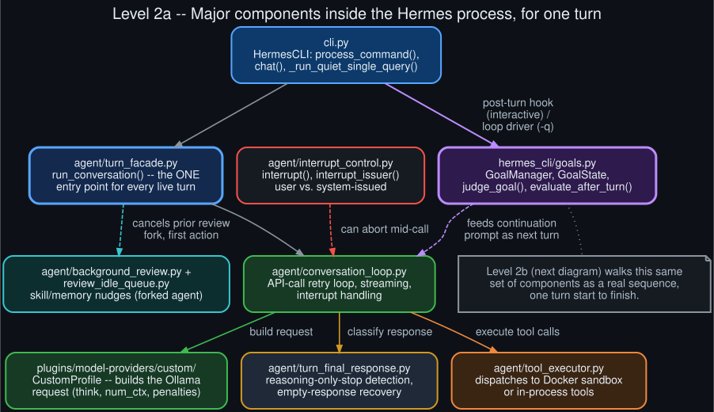

# Level 2a — Component architecture

  

Zooming into the "Hermes Agent process" box from [Level 1](system_context.md), one turn touches a
specific, fairly small set of modules:

- **`cli.py`** (`HermesCLI`) — the entry point for every surface (interactive REPL, single-query
  `-q`/`-Q`, gateway). Dispatches slash commands, decides which turn-driving mechanism applies.
- **`agent/turn_facade.py`** (`run_conversation()`) — the single, shared entry point every live
  turn goes through, regardless of surface. Its first action is cancelling any in-flight
  background-review fork for the session, before anything else runs.
- **`agent/conversation_loop.py`** — owns the actual API-call retry loop: streaming, stale-stream
  detection, interrupt handling, and driving the request through to a classified response.
- **`plugins/model-providers/custom/`** (`CustomProfile`) — the Ollama-specific request builder:
  turns Hermes's internal reasoning/context config into the actual `think`, `num_ctx`, and
  extra-body fields Ollama's request shape needs.
- **`agent/turn_final_response.py`** — classifies the raw response: normal text, reasoning-only
  clean stop (see [Level 4](ollama_request_response_anatomy.md)), or something needing the
  empty-response recovery ladder.
- **`agent/tool_executor.py`** — dispatches any tool calls the model made, to the Docker sandbox or
  an in-process tool, and feeds results back for the next API call within the same turn.
- **`hermes_cli/goals.py`** (`GoalManager`, `judge_goal`) — the standing-goal engine, invoked after
  a turn completes if a goal is active. Detailed in [Level 3](goal_state_machine.md).
- **`agent/background_review.py` + `agent/review_idle_queue.py`** — the periodic skill/memory
  self-review mechanism: forks a separate `AIAgent` to replay the conversation and suggest
  updates, gets cancelled the instant the next live turn starts.
- **`agent/interrupt_control.py`** — the shared interrupt API; distinguishes user-issued stops from
  system-issued ones (watchdog stalls, lease loss, timeouts) via `interrupt_issuer()`.

The exact sequence these components run in, for one turn, is [Level 2b](turn_lifecycle_sequence.md).
