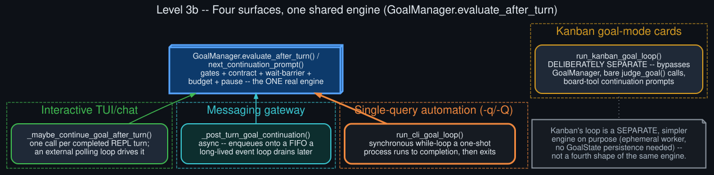

# Level 3b — Four surfaces, one shared engine

  

`GoalManager.evaluate_after_turn()` / `next_continuation_prompt()` — the state machine in
[Level 3a](goal_state_machine.md) — is the one real engine behind `/goal`. Every surface that
supports it drives that *same* engine, but each has to solve a different "how do I actually run
another turn" problem given its own execution model:

- **Interactive TUI/chat** (`_maybe_continue_goal_after_turn`) — the simplest shape: a single
  function called once per completed REPL turn. It doesn't loop itself; the REPL's own polling of
  a pending-input queue is the thing that keeps calling it, turn after turn.
- **Messaging gateway** (`_post_turn_goal_continuation`) — async. "Continuing the loop" means
  enqueueing the continuation prompt onto a per-session FIFO that the gateway's own long-lived
  event loop drains later as an ordinary incoming message, re-entering the whole turn pipeline.
- **Single-query automation** (`-q`/`-Q`, `run_cli_goal_loop`) — a synchronous `while` loop that
  a one-shot process runs to completion by itself before exiting, since there's no REPL or event
  loop to hand continuation off to. (This driver didn't exist before session 1789857956 —
  `/goal` in `-q` mode was a silent no-op until then; see the `hermes-goal-loop-deferral` repo.)
- **Kanban goal-mode cards** (`run_kanban_goal_loop`) — deliberately *not* the same engine. A
  Kanban worker is an ephemeral process with no need for persisted `GoalState`, pause/resume,
  gates, or a wait-barrier — it calls the bare judge directly and drives completion via
  Kanban-board tool calls (`kanban_complete`, `kanban_block`) instead of a `done` verdict. This is
  a parallel, simpler mechanism that happens to reuse the same judge model, not a fourth shape of
  the primary engine.

The practical lesson from building the `-q` driver: match the *substance* of whichever existing
driver already does what you need (the gateway hook's use of the real engine, in that case), not
just the *shape* of whichever one looks structurally similar (Kanban's synchronous loop, in that
case) — the two axes are independent, and conflating them is how you end up reimplementing the
wrong engine with the right control flow.
