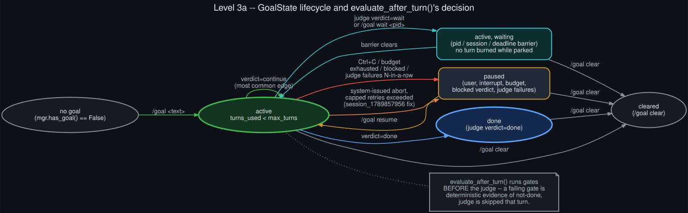

# Level 3a — GoalState lifecycle

  

`/goal`'s state (`GoalState`, persisted per-session in `SessionDB`) moves through a small set of
statuses, all transitions driven by `GoalManager` methods and `evaluate_after_turn()`'s decision:

- **no goal → active**: `/goal <text>` (`mgr.set(...)`). Also kicks off the first turn immediately.
- **active → active** (the common case): the judge returns `continue`, a continuation prompt gets
  queued as the next turn.
- **active → waiting**: either the judge itself returns a `wait` verdict with a directive (park on
  a live background process or a timed deadline), or the operator explicitly runs `/goal wait
  <pid>`. While waiting, `evaluate_after_turn()` short-circuits without burning a turn or calling
  the judge — the loop resumes automatically once the barrier clears.
- **active → paused**: several distinct triggers land here — a genuine user Ctrl+C, the turn budget
  running out, the judge returning `blocked` (goal ruled unachievable as stated), persistent judge
  API/parse failures, *and* (as of the fix documented in the sibling `hermes-goal-loop-deferral`
  repo) a capped run of consecutive system-issued turn aborts. All are recoverable via `/goal
  resume`.
- **active → done**: the judge returns `done`.
- **any state → cleared**: `/goal clear`.

**Gates run before the judge.** If the goal has quality gates configured (`/goal gate add <cmd>`),
they run as deterministic shell checks first; a failing gate is treated as certain evidence the
goal isn't done, and its output becomes the continuation prompt directly — the judge is skipped
entirely for that turn, since there's nothing to adjudicate.

This state machine is identical regardless of which surface is driving it — see
[Level 3b](goal_loop_driver_shapes.md) for how the four different callers (interactive TUI,
gateway, single-query automation, Kanban) each wire into it.
