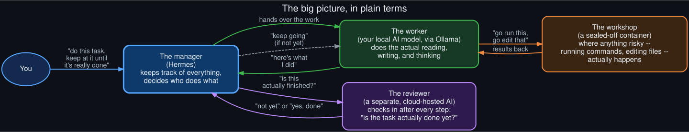
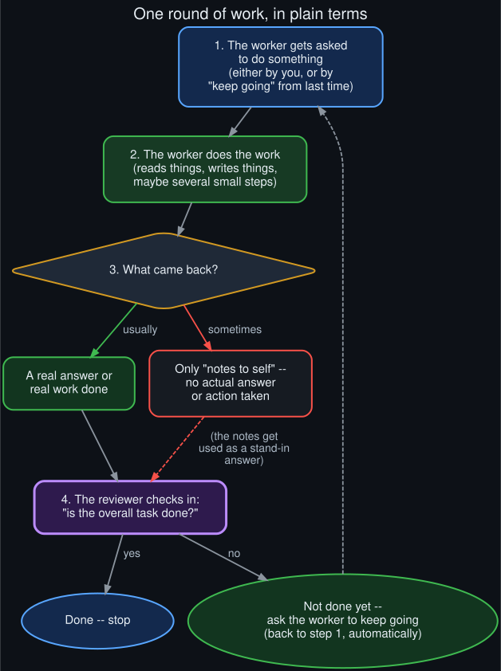
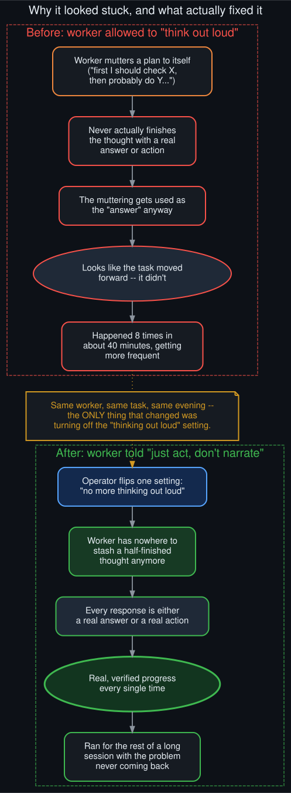

# The plain-language version

  

No code, no file paths, no jargon — just what this whole system actually does, and why it
sometimes seemed to get stuck.

## What Hermes and Ollama are

**Ollama** runs an AI model on your own computer, using your own graphics card, instead of sending
everything to a company's servers over the internet. **Hermes** is a program that sits on top of
that local model and turns it into something that can actually get things done — read files, run
commands, write code — instead of just chatting.

## Four helpers, not one

It's tempting to think of "the AI" as one single thing. It's actually four separate helpers
working together:

- **A manager** (Hermes itself) that keeps track of what you asked for and decides what happens
  next.
- **A worker** (your local model, via Ollama) that does the actual reading, writing, and thinking.
- **A reviewer** — a *different* AI, one that runs elsewhere on the internet, not on your computer
  — whose only job is to check in after each step and answer one question: "is this actually
  done yet?"
- **A sealed-off workshop** (a locked-down container) where anything the worker asks for — running
  a command, editing a file — actually happens, kept separate from the rest of your computer.

## What "give it a goal" actually does

Normally, you'd have to keep telling the assistant "keep going" after every single step, or it
just stops and waits for you. Setting a standing goal is like leaving a written to-do list with a
supervisor instead of a single instruction: after every round of work, the reviewer automatically
checks whether the list is finished, and if it isn't, tells the worker to keep going — without you
having to say anything.

  

## Why it sometimes looked stuck

Every so often, instead of doing the next real step, the worker would just... think to itself.
Not out loud where anyone could see progress — it would draft a plan, weigh a few options,
half-decide what to do next — and then stop there, without ever actually writing the file,
running the command, or giving a real answer. Because *something* came back, that leftover
thinking got used as if it were the real response.

The reviewer still checked in and still gave an honest answer each time — so the system wasn't
silently broken. But if the "leftover thinking" reads like progress ("I should now go do the
next part..."), the reviewer can reasonably say "keep going," and the loop just... spins. Turn
after turn goes by with barely any real work happening. From the outside, watching the session,
that's indistinguishable from the whole thing just not working.

## The fix that actually worked

The local model has a setting for whether it's allowed to think through a problem out loud before
answering. Turning that setting all the way off doesn't just make the model skip *some* of its
thinking — it removes the place that thinking would have gone entirely. With nowhere to stash a
half-finished thought, every single response has to be a real answer or a real action.

  

That's not a guess — it's exactly what was watched happening live: the same worker, doing the same
real task, on the same evening, stalled eight times in about forty minutes with that setting on,
then ran the rest of a long session with zero stalls the moment it was turned off.

## Want the real mechanism?

This page is deliberately the simple version. The [four technical levels](../README.md#the-four-levels)
in this repo walk through the actual code, the actual network requests, and the actual state
machine behind every sentence above.
