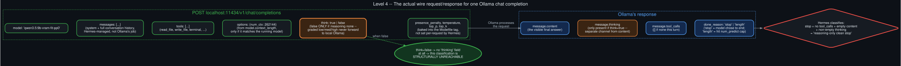

# Level 4 — Ollama request/response anatomy

  

The most granular level: what Hermes actually sends to, and gets back from, Ollama's
OpenAI-compatible endpoint (`localhost:11434/v1/chat/completions`) for a single chat completion.

**Request, built by `CustomProfile` (`plugins/model-providers/custom/`):**

- `model` — the Ollama tag name, e.g. `qwen3.5:9b-vram-fit-pp0`.
- `messages` — the full conversation history plus system prompt, entirely Hermes-managed; Ollama
  has no memory of prior turns beyond what's sent each time.
- `tools` — the tool schemas the model may call this turn (`read_file`, `write_file`, `terminal`,
  etc.).
- `options.num_ctx` — forwarded from `model.context_length` in `config.yaml`, but **only if it
  matches the model that's actually running** — a mismatch is silently ignored (an app-level
  config value describing a "different" runtime).
- `think` — `true` or `false`. This is the one field with a genuine behavioral gotcha: it is
  **only** ever sent as `false`, and only when reasoning is *fully* disabled (`/reasoning none`).
  Graded effort levels (`low`/`medium`/`high`) never forward to local Ollama at all — a documented
  limitation that's easy to mistake for "reasoning control doesn't work on local models," when
  really only the fully-off case does anything.
- `presence_penalty`, `temperature`, `top_p`, `top_k` — baked into the Ollama tag's own Modelfile
  (`PARAMETER ...` lines), not set per-request by Hermes. Changing these means building a new
  derived tag, not a runtime flag.

**Response:**

- `message.content` — the visible final answer.
- `message.thinking` — present *only* if `think` was `true` for this request; a separate channel
  from `content`, not merged into it.
- `message.tool_calls` — empty if the model made none this turn.
- `done_reason` — `"stop"` (the model chose to end) or `"length"` (hit the output-token cap).

**Where "reasoning-only clean stop" comes from:** Hermes classifies a response as this specific
failure mode when `done_reason=="stop"` AND `tool_calls` is empty AND `content` is empty/whitespace
AND the extracted `thinking` is non-empty — i.e. the model produced only reasoning and never
committed to an answer or an action, but the provider considers the turn genuinely finished (not
truncated). **With `think=false`, `message.thinking` doesn't exist as a field at all** — there's no
reasoning content for the model to strand an answer in, so this exact failure mode becomes
structurally unreachable rather than merely less likely. This was confirmed live: 8 reasoning-only
stalls in ~40 minutes with reasoning on, 0 across 287 goal-judge calls with it off, same session,
same model, same box.
