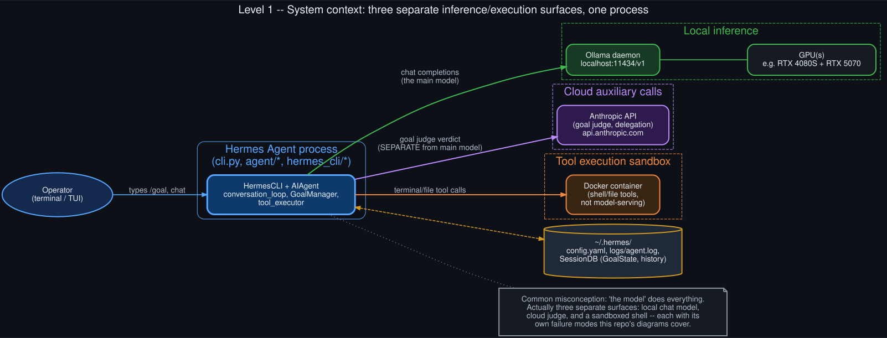

# Level 1 — System context

  

The most common mental model of "an AI coding agent" is a single black box: you type, the model
answers. Hermes Agent, running against a local Ollama model with `/goal` active, is actually three
separate surfaces glued together by one orchestrating process:

1. **The main chat model** — Ollama, running locally (`localhost:11434/v1`), on the operator's own
   GPU(s). This is what does the actual reading, writing, and tool-calling work every turn.
2. **The goal judge** — a *separate*, cloud-hosted call to Anthropic (`claude-haiku-4-5` at time of
   writing), used only to evaluate whether the standing goal is satisfied after each turn. It never
   sees the full tool-execution detail the main model does — just the goal text, the last response,
   and some structured context (subgoals, background processes, contract).
3. **The tool-execution sandbox** — a Docker container the shell/file tools actually run inside,
   isolated from the host. This has no role in model serving at all; it's purely where
   `terminal`/`read_file`/`write_file`-style tool calls land.

All three are coordinated by one process, `hermes` (`cli.py`'s `HermesCLI` + `agent.AIAgent`), which
also persists state to `~/.hermes/` — config, logs, and a SQLite-backed `SessionDB` holding
conversation history and `GoalState`.

**Why this separation matters for debugging:** a problem that looks like "the model is being
unreliable" can actually originate in any of the three surfaces, or in the orchestration between
them — and they fail independently. A slow or unreachable Ollama daemon, a rate-limited Anthropic
judge, and a wedged Docker container produce very different symptoms, but a shallow read of "the
agent isn't working" collapses all three into one undifferentiated complaint. Every deeper level in
this repo picks apart one piece of this diagram in more detail.
