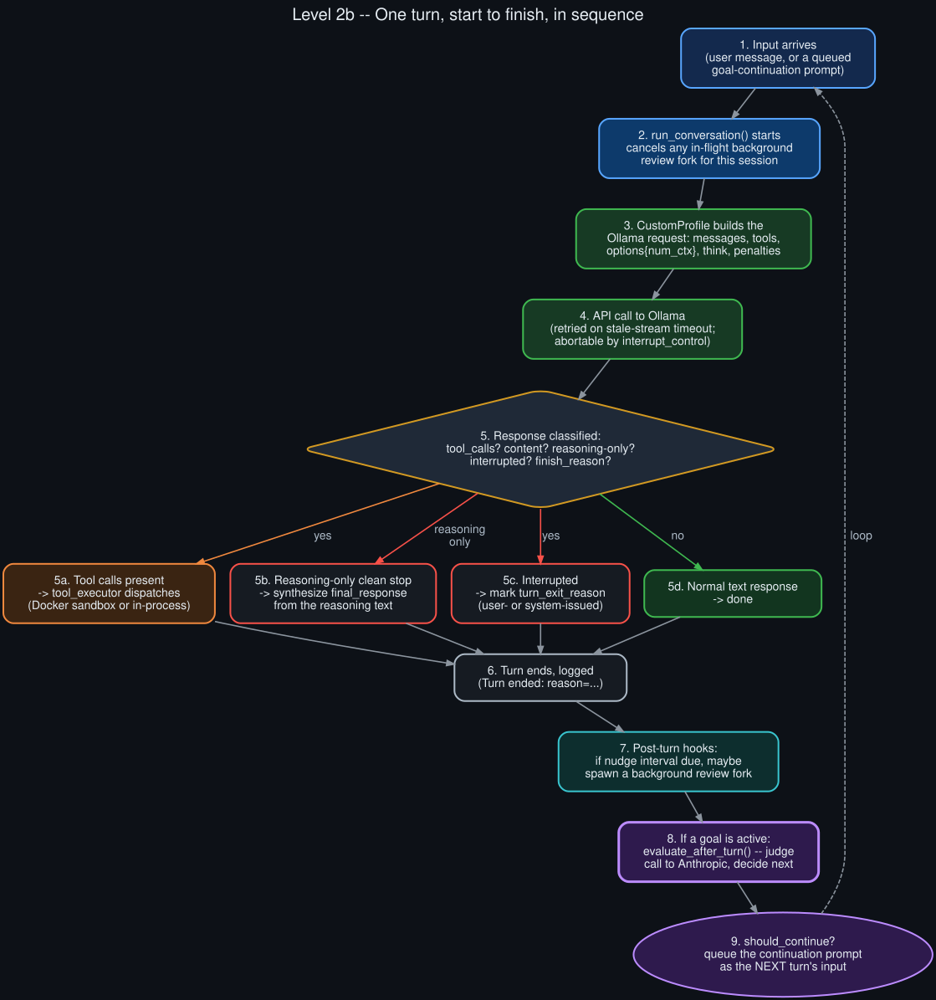

# Level 2b — Turn lifecycle sequence

  

The same components from [Level 2a](component_architecture.md), walked as an actual sequence, one
turn start to finish:

1. **Input arrives** — either a real user message, or a queued goal-continuation prompt (from step
   9 of the *previous* turn, if a goal was active and the judge said `continue`).
2. **`run_conversation()` starts** — its first action, unconditionally, is cancelling any in-flight
   background-review fork for this session. Foreground work always wins.
3. **The Ollama request is built** — `CustomProfile` assembles `messages`, `tools`, `options`
   (`num_ctx`, etc.), `think`, and the model's baked-in sampling parameters. Full anatomy in
   [Level 4](ollama_request_response_anatomy.md).
4. **The API call happens** — streamed, with stale-stream retry logic and an abort path via
   `interrupt_control`.
5. **The response gets classified** into one of four outcomes:
   - **5a. Tool calls present** — dispatched via `tool_executor`, results fed back for another
     API call within the same turn (this is why one "turn" can span dozens of API calls).
   - **5b. Reasoning-only clean stop** — the model produced only chain-of-thought and no content;
     Hermes synthesizes a final response from the reasoning text so the turn doesn't come back
     empty.
   - **5c. Interrupted** — the turn's `turn_exit_reason` gets tagged as either user-issued
     (`interrupted_by_user`) or system-issued (`interrupted_by_system(<issuer>)`), which later
     determines whether an active goal auto-pauses or silently retries.
   - **5d. Normal text response** — the straightforward case.
6. **The turn ends and gets logged** (`Turn ended: reason=...` in `agent.log`).
7. **Post-turn hooks run** — if a skill/memory nudge interval is due and this turn wasn't
   interrupted, a background review fork may be spawned (and will itself get cancelled at step 2
   of whatever turn runs next).
8. **If a goal is active, `evaluate_after_turn()` runs** — gates first (deterministic, no API
   call), then the judge (a real call to Anthropic).
9. **The decision determines what happens next** — if `should_continue`, the continuation prompt
   gets queued as step 1 of the next iteration of this exact sequence.
