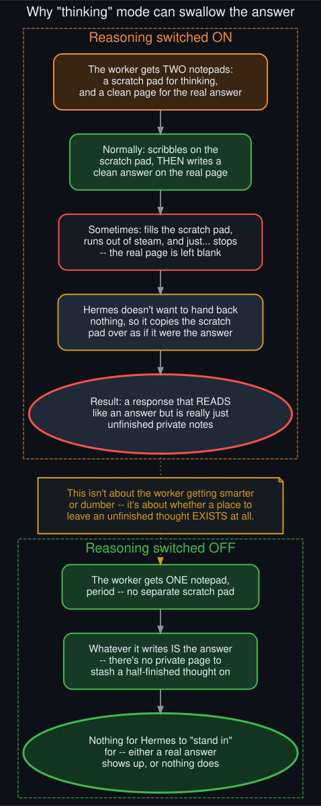
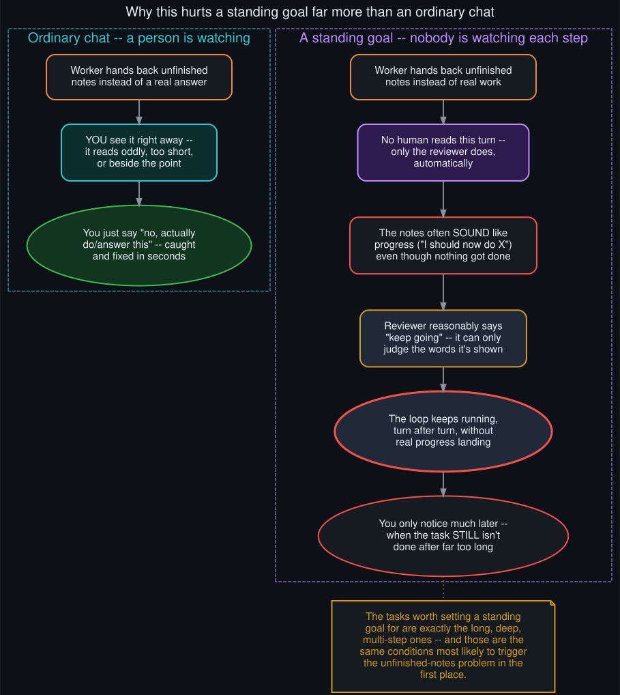

# Why does turning reasoning on or off affect goal functionality?

  

This is the plain-language "why" behind [the technical mechanism](ollama_request_response_anatomy.md)
(see "Where reasoning-only clean stop comes from") and
[the live-confirmed fix](https://github.com/danindiana/hermes-goal-loop-deferral/blob/main/docs/qwen35_vs_nemotron_goal_reliability.md)
documented in the sibling repo — one focused answer to one specific question, in two parts.

## Part 1: why can "thinking" swallow the answer at all?

A model running with reasoning turned on effectively gets two separate places to write: a private
scratch area for working through the problem, and the actual reply. Most of the time it uses the
scratch area, then writes a clean final answer. But every so often — more often the longer and
deeper the conversation has gotten — it fills the scratch area and then just stops, without ever
writing anything on the "real" page. The provider still reports the turn as finished normally, not
cut off; the model, in a real sense, considered itself done.

Hermes has to handle this gracefully rather than hand back nothing, so it takes whatever ended up
in the scratch area and uses it as the reply instead. That's a sensible fallback — but it means the
"answer" that comes back is really just unfinished private notes wearing the answer's clothes.

**Turning reasoning off removes the scratch area entirely.** There's no longer a separate place for
a half-finished thought to live — whatever the model produces has to go directly into the one
channel that becomes the reply. It isn't that the model gets better at finishing its thoughts; the
place a thought could go unfinished simply doesn't exist anymore.

## Part 2: why does this hit a standing goal so much harder than a normal chat?

  

In an ordinary back-and-forth conversation, a "notes instead of an answer" reply is obvious and
cheap to fix — you read it, it looks off, you say so, done in seconds. A standing goal exists
specifically so you *don't* have to read every single reply — a separate reviewer checks in after
each step and decides whether to keep going, automatically.

That's exactly where the trouble compounds: the reviewer isn't verifying that real work happened,
it's judging a piece of text. Unfinished notes very often narrate intent in a way that reads a lot
like a progress update — "I should now write the file and then check it" sounds like someone
describing what they're about to do, not like someone who never actually did it. The reviewer,
reasonably, often says "keep going." Nothing has silently broken — the mechanism is working exactly
as designed — but the *content* it's evaluating each time isn't real progress, so the loop can spin
for many turns without the task actually advancing, and nobody's watching closely enough to notice
until it's taken far longer than it should have.

There's a genuine irony here: the tasks worth setting a standing goal for in the first place are
the long, multi-step ones — and those are exactly the conditions (deep into a long session, lots of
prior context) most likely to trigger the unfinished-notes problem to begin with. The feature and
the failure mode target the same kind of task.

## The fix, in these same terms

Turning reasoning off doesn't make the worker smarter or the reviewer stricter — it just removes
the one place an unfinished thought could hide. Every reply becomes either a real answer or a real
action, which means the reviewer is always looking at something genuine, and the "sounds like
progress but isn't" trap stops being possible. That's not a guess: the exact same task, on the
exact same evening, went from stalling every twenty seconds to running clean for the rest of a long
session the moment this one setting changed — and it was independently reproduced a second time,
on demand, in a brand-new session.

For the full mechanism (the actual field in the actual network request, and the code that decides
whether it gets sent), see [Level 4](ollama_request_response_anatomy.md). For the plain-language
tour of the whole system this fits into, see [`lay_explain.md`](lay_explain.md).
